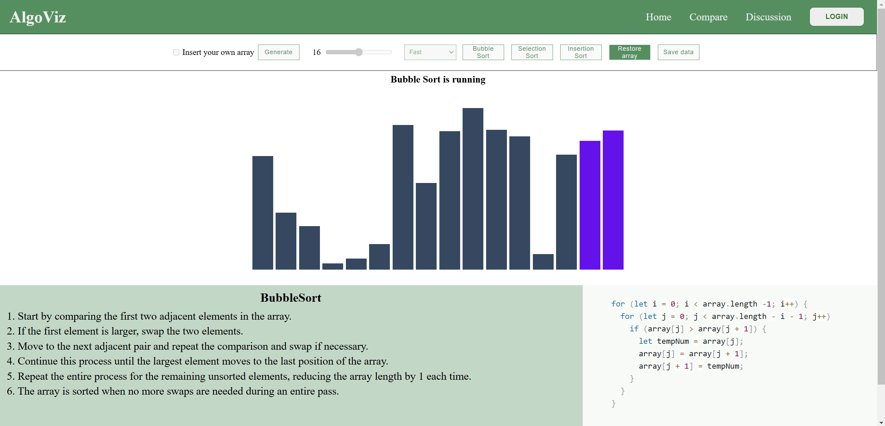
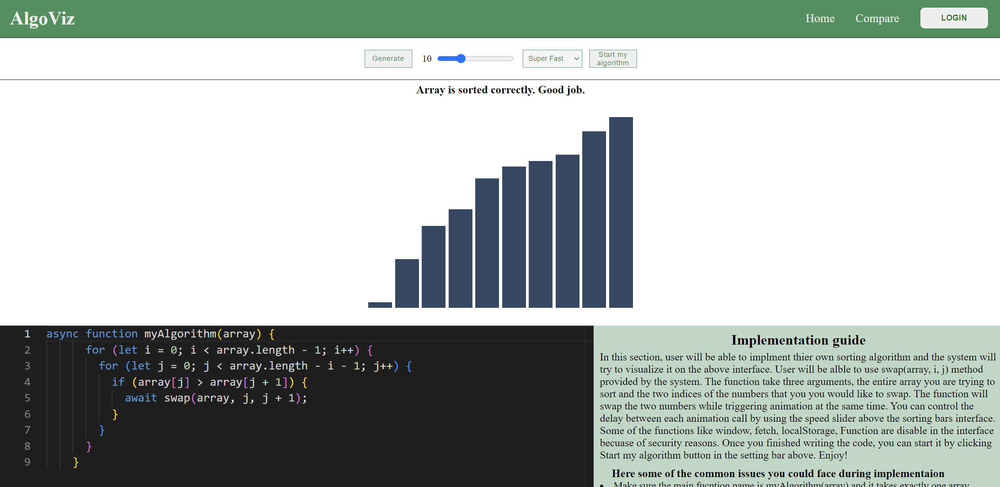
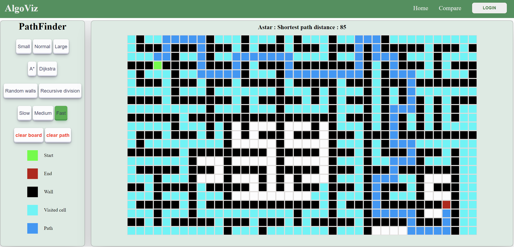
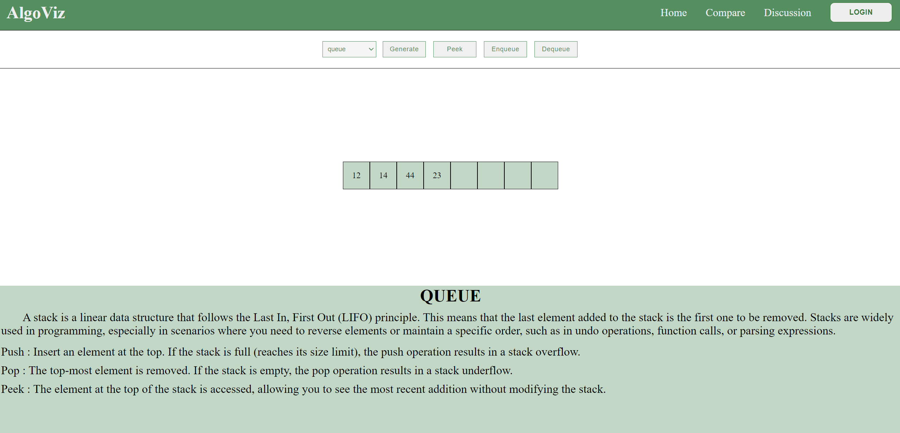
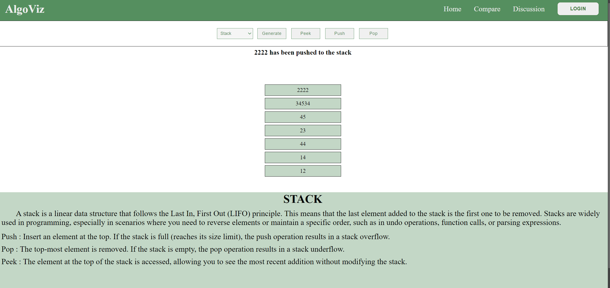
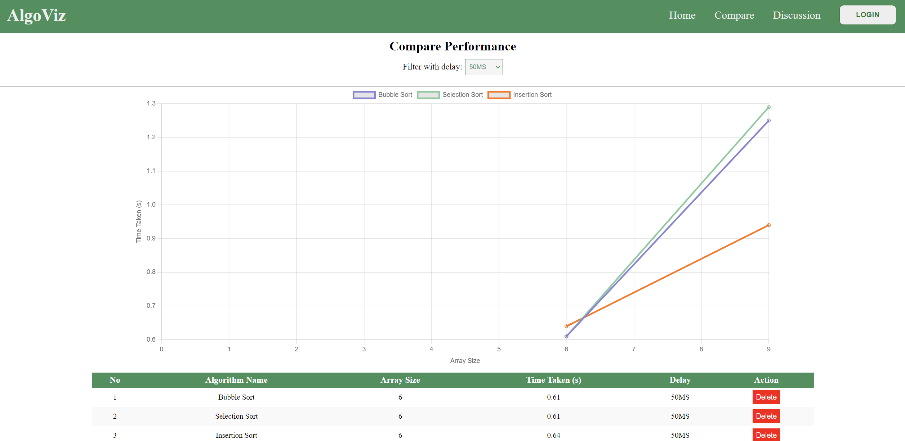
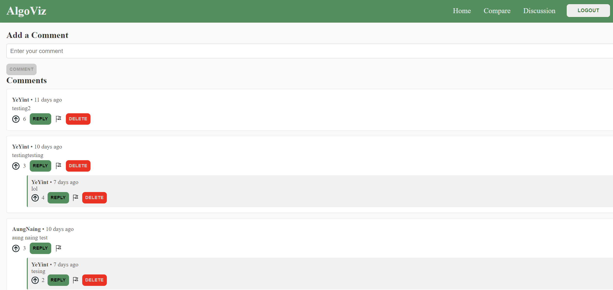

# [AlgoViz - Algorithm Visualization App](https://algoviz.yeyintaungnaing.com/)

## Overview
AlgoViz is an interactive web application designed to help users understand sorting, pathfinding, and data structure algorithms through real-time visualizations. The app offers customization options, a discussion forum, and a performance comparison tool, making it a powerful learning resource.

## ✨ Inspiration
Was initially inspired by this [Repo](https://github.com/clementmihailescu/Pathfinding-Visualizer) by **Clementmihailescu** and decided to do comprehensive visualization web application with additional features.

## Live Demo
If you want to jump straight into the wesbite you can try it right here 👉 [AlgoViz](https://algoviz.yeyintaungnaing.com/)

---

## Features
### 📊 Algorithm Visualizer
- Supports various **Sorting algorithms** (Bubble Sort, Insertion Sort, Selection Sort).
- Includes **Pathfinding algorithms** (Dijkstra's, A*).
- **Data structure visualization** (Stacks, Queues).
- Adjustable **speed controls** and **array size** selection.
- Inserting own array to test as you like

### 💬 Discussion Thread
- **Real-time discussion** section powered by Firebase.
- Users can engage in conversation with other users in discussion section

### ⚡ Performance Comparison
- **Graph-based analysis** to compare runtime complexity.
- **Filters** to analyze different algorithms based on execution speed.
- **Table representation** for detailed insights into performance.

### 🛠 Custom Algorithm 
- **"My Algorithm"** feature allowing users to write their own custom sorting algorithm and visualize it immediately on the screen
- Built-in code editor with syntax highlighting.
- Sandboxed execution environment to prevent security issues.

---

## Tech Stack
- **React.js** For frontend development
- **Firebase** Database and authentication
- **Javascript, HTML & SCSS** Algorithms, animation and syles
- **monaco** Implementing code editor for "My Algorithm" page
- **Prism.js** For syntax highlighting
- **react-chartjs-2** Graph for time comparison page

---

## **📸 Screenshots** 

- ### Authentication page

---

- ### Sorting visualizer

---

- ### Custom sorting visualizer

---

- ### Pathfinding visualizer

---

- ### Data structure visualizer (Queue)

---

- ### Data structure visualizer (Stack)

---

- ### Algorithm time complexity comparison

---

- ### Discussion Thread

---

### Future plan

- **Implement more algorithms and data structure visualizations**
- **Improve sorting animation with a proper swaping movements**
- **Space complexity comprison**
- **Allow user to save thier custom algorithms**
- **Support more programming languages**

